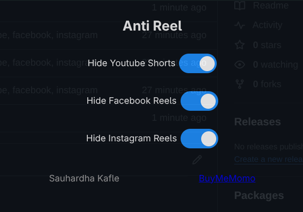

# Anti-Reel Extension

> This is so that you can spend more time with your family.

## Installation (Developer Mode)

1. **Download or clone this repository** to your local machine.

2. **Open your browser’s extensions page**:
   - Chrome/Edge/Brave: `chrome://extensions/`

3. **Enable Developer Mode**:
   - Toggle the switch in the top right corner.

4. **Load the unpacked extension**:
   - Click **“Load unpacked”**
   - Select the folder containing the extension (where `manifest.json` is located).

5. **Pin the extension** (optional):
   - Click the puzzle icon in the toolbar
   - Pin “Anti-Reels” for easy access

6. **Open the popup**:
   - Toggle the platforms you want to hide (YouTube, Facebook, Instagram)

7. **Visit YouTube, Facebook, or Instagram**:
   - Reels/Shorts should now be hidden automatically.

---

## Usage Notes

- Click on the extension and toggle the button to on/off the reels.
- For best results, reload pages after toggling options.
  > NOTE: Tested only on Chromium based browser.

Copyright (c) 2025 Sauhardha Kafle. All Rights Reserved.
 
[BuyMeMomo](https://buymemomo.com/sauhardha)
